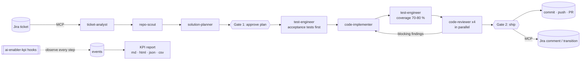

# ai-enabler

A Claude Code marketplace for teams that want the machine to do the delivery work — starting from a Jira ticket, without a spec-driven process — and want to measure what that costs in human attention, time and money.

It ships two plugins:

| Plugin | What it does |
|---|---|
| [`ai-enabler`](plugins/ai-enabler/README.md) | Takes a Jira ticket to a pull request. Dedicated subagents read the ticket through the Jira MCP server, analyse the repository, plan, implement, test and review; the human decides at two gates, the plan and the ship. |
| [`ai-enabler-kpi`](plugins/ai-enabler-kpi/README.md) | Opt-in hooks that record human interaction, AI working time and token usage, and a report that turns them into KPIs and cost in USD per session, user, ticket, skill and model. Works with any workflow, not only `ai-enabler`. |

## How it works



One command runs the whole flow:

```
/ai-enabler:deliver PROJ-123
```

If you say no at the second stop, nothing is uploaded — and a hook enforces it (see "When you say no" in the plugin README).

The pipeline stops twice: once to show the plan before any code is written, once to show the result before anything leaves the machine. Everything in between runs unattended: reading the ticket, learning the repository's conventions, writing the tests for the acceptance criteria, writing the code that makes them pass, completing the tests up to the coverage target (80 %, with 70 % as the minimum), reviewing and fixing. If coverage ends up under the minimum, it stops once more and asks whether to proceed. Each stage is also a skill of its own, for teams that want to adopt it piece by piece.

## Install

```
/plugin marketplace add <git URL of this repository>
/plugin install ai-enabler@ai-enabler
/plugin install ai-enabler-kpi@ai-enabler
```

From a local clone, `/plugin marketplace add ./` works as well. To try it without installing:

```
claude --plugin-dir plugins/ai-enabler --plugin-dir plugins/ai-enabler-kpi
```

Requirements:

- A Jira MCP server connected to Claude Code, to read tickets. See [docs/jira-mcp.md](docs/jira-mcp.md). Without one, the pipeline accepts a Markdown file with the requirements instead.
- `git`, and `gh` (or `glab`) for pull requests.
- `python3` (3.8 or later) on the `PATH`, for the KPI hooks and report. No extra packages.

## Quick start

```
/ai-enabler:doctor PROJ-123         # check the setup: Jira MCP, git, tests, config
/ai-enabler-kpi:kpi-init            # switch KPI capture on for this repository
                                 # (counts from here on; earlier spend in this session is not billed)

/ai-enabler:deliver PROJ-123        # ticket -> plan gate -> tests, code, coverage, review -> ship gate -> PR

/ai-enabler-kpi:kpi-report          # what it took: interactions, time, cost
```

## Skills at a glance

| Skill | Use it to |
|---|---|
| `/ai-enabler:deliver <KEY>` | Run the full pipeline from a ticket to a pull request, or resume a run |
| `/ai-enabler:plan <KEY>` | Get an implementation plan and a readiness verdict, without writing code |
| `/ai-enabler:implement <KEY>` | Execute an approved plan |
| `/ai-enabler:test [KEY \| paths]` | Generate and run tests for a change, against a coverage target of 80 % and a minimum of 70 % |
| `/ai-enabler:review [KEY \| PR \| paths]` | Independent multi-lens review, with optional auto-fix |
| `/ai-enabler:ship [KEY]` | Commit, push, open the pull request, update Jira |
| `/ai-enabler:doctor` | Check or initialise the project setup |
| `/ai-enabler-kpi:kpi-init` | Switch KPI capture on for a project |
| `/ai-enabler-kpi:kpi-report` | Produce the KPI report |

## Documentation

| Document | Content |
|---|---|
| [docs/design.md](docs/design.md) | Why the marketplace is shaped this way: what was taken from AI Enablement, what from AIAD, and the decisions behind the pipeline |
| [plugins/ai-enabler/README.md](plugins/ai-enabler/README.md) | The delivery pipeline: stages, subagents, gates, configuration, run directory, safety rules |
| [plugins/ai-enabler-kpi/README.md](plugins/ai-enabler-kpi/README.md) | KPI capture and reporting: what is measured, privacy, sharing, the report |
| [docs/kpi-reference.md](docs/kpi-reference.md) | Event schema, KPI definitions and formulas, pricing, known limits |
| [docs/jira-mcp.md](docs/jira-mcp.md) | Connecting Jira (Cloud or Data Center) through MCP |

## Repository layout

```
.claude-plugin/marketplace.json     marketplace catalogue
plugins/
  ai-enabler/
    .claude-plugin/plugin.json
    skills/      deliver, plan, implement, test, review, ship, doctor
    agents/      ticket-analyst, repo-scout, solution-planner,
                 code-implementer, test-engineer, code-reviewer
    references/  run directory and configuration, git and Jira safety rules, review checklist
    hooks/       hooks.json, remote_guard.py (blocks uploads when the project is local-only)
    tests/       test_remote_guard.py
  ai-enabler-kpi/
    .claude-plugin/plugin.json
    hooks/       hooks.json, kpi_hook.py
    scripts/     kpi_report.py, update_pricing.py, pricing.json
    skills/      kpi-init, kpi-report
    tests/       test_kpi.py
docs/            design, KPI reference, Jira MCP setup
```

## Development

```
claude plugin validate .                       # marketplace and plugin manifests
python3 plugins/ai-enabler-kpi/tests/test_kpi.py  # hook and report, end to end, no Claude Code needed
python3 plugins/ai-enabler/tests/test_remote_guard.py  # what local-only mode blocks and allows
```

Skills, agents and references are plain Markdown; edit them and start a new session (or run `/reload-plugins`) to pick up the change. Prices live in `plugins/ai-enabler-kpi/scripts/pricing.json`: refresh the Amazon Bedrock section with `python3 plugins/ai-enabler-kpi/scripts/update_pricing.py` (it reads AWS's public price list), and edit the Anthropic section by hand when list prices change.
