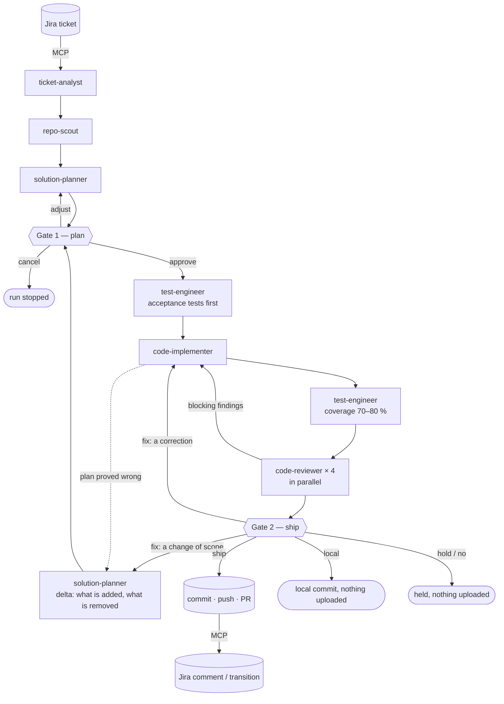

# ai-enabler

A Claude Code marketplace for teams that want the machine to do the delivery work — starting from a Jira ticket, without a spec-driven process — and want to measure what that costs in human attention, time and money.

It ships two plugins:

| Plugin | What it does |
|---|---|
| [`ai-enabler`](plugins/ai-enabler/README.md) | Takes a Jira ticket to a pull request. Dedicated subagents read the ticket through the Jira MCP server, analyse the repository, plan, implement, test and review; the human decides at two gates, the plan and the ship. |
| [`ai-enabler-kpi`](plugins/ai-enabler-kpi/README.md) | Measures AI usage with opt-in hooks (human interaction, AI working time, token cost in USD per session, user, ticket, skill and model) and delivery flow with scripts (pull request size, review waiting time, rework, Jira cycle time), and reports both as HTML dashboards with charts and per-developer figures. Works with any workflow, not only `ai-enabler`. |

## How it works



One command runs the whole flow:

```
/ai-enabler:deliver PROJ-123
```

If you say no at the second stop, nothing is uploaded — and a hook enforces it (see "When you say no" in the plugin README).

Reading the loops in the diagram:

- **Gate 1, `adjust`** — the plan goes back to the planner and returns to the gate. **`cancel`** stops the run; nothing was written outside its folder.
- **Gate 2, `fix`** — a correction goes to the implementer and comes back through coverage and review. A change to *what* is being built becomes a **delta**: a written, approved change to the plan that lists what is added and what is removed, and is carried out acceptance tests first — new tests written and obsolete ones deleted, then code written and dead code deleted.
- **Gate 2, `local` / `hold` / `no`** — nothing is uploaded: a local commit, or the work left as it is.
- After three rounds at the same gate the pipeline offers to hand over instead of trying a fourth time on its own.

The pipeline stops twice: once to show the plan before any code is written, once to show the result before anything leaves the machine. Everything in between runs unattended: reading the ticket, learning the repository's conventions, writing the tests for the acceptance criteria, writing the code that makes them pass, completing the tests up to the coverage target (80 %, with 70 % as the minimum), reviewing and fixing. If coverage ends up under the minimum, it stops once more and asks whether to proceed. Each stage is also a skill of its own, for teams that want to adopt it piece by piece.

## Install

```
/plugin marketplace add <git URL of this repository>
/plugin install ai-enabler@ai-enabler
/plugin install ai-enabler-kpi@ai-enabler
```

From a local clone, `/plugin marketplace add ./` works as well. To try it without installing:

```
claude --plugin-dir plugins/ai-enabler --plugin-dir plugins/ai-enabler-kpi
```

Requirements:

- A Jira MCP server connected to Claude Code, to read tickets. See [docs/jira-mcp.md](docs/jira-mcp.md). Without one, the pipeline accepts a Markdown file with the requirements instead.
- `git`, and the GitHub CLI `gh` (https://cli.github.com, then `gh auth login`): it opens pull requests for `ai-enabler` and is how `ai-enabler-kpi` reads them for the delivery metrics. `glab` works for opening merge requests on GitLab.
- `python3` (3.8 or later) on the `PATH`, for the KPI hooks and report. No extra packages.

## Quick start

```
/ai-enabler:doctor PROJ-123         # check the setup: Jira MCP, git, tests, config
/ai-enabler-kpi:kpi-init            # switch KPI capture on for this repository
                                 # (counts from here on; earlier spend in this session is not billed)

/ai-enabler:deliver PROJ-123        # ticket -> plan gate -> tests, code, coverage, review -> ship gate -> PR

/ai-enabler-kpi:kpi-report          # what it took: interactions, time, cost
```

## Skills at a glance

| Skill | Use it to |
|---|---|
| `/ai-enabler:deliver <KEY>` | Run the full pipeline from a ticket to a pull request, or resume a run |
| `/ai-enabler:plan <KEY>` | Get an implementation plan and a readiness verdict, without writing code |
| `/ai-enabler:implement <KEY>` | Execute an approved plan |
| `/ai-enabler:test [KEY \| paths]` | Generate and run tests for a change, against a coverage target of 80 % and a minimum of 70 % |
| `/ai-enabler:review [KEY \| PR \| paths]` | Independent multi-lens review, with optional auto-fix |
| `/ai-enabler:ship [KEY]` | Commit, push, open the pull request, update Jira |
| `/ai-enabler:doctor` | Check or initialise the project setup |
| `/ai-enabler-kpi:kpi-init` | Switch KPI capture on for a project |
| `/ai-enabler-kpi:kpi-report` | Produce the KPI report: AI usage and delivery flow, as HTML dashboards with charts |
| `/ai-enabler-kpi:delivery-report` | Delivery-flow dashboard: PR size, review waiting time, rework, Jira cycle time, per developer |
| `/ai-enabler-kpi:pr-size`, `review-wait`, `rework`, `cycle-time` | One delivery metric at a time |

## What appears in your project: the `.enabler/` folder

Both plugins keep their files in one folder at the root of the project where you use them. Nothing is written anywhere else in your repository apart from the code, the tests and the `.gitignore` rule.

```
.enabler/
  config.json                 pipeline settings for this project (optional, commit it)
  local-only                  present only after someone said "do not upload"; blocks push, PR and Jira writes
  runs/                       one folder per ticket — working files, kept out of git
    <KEY>/
      state.json              where the run stands; lets it be resumed
      requirements.json       the ticket, normalised, with its acceptance criteria
      repo-context.md         how this repository is built and written
      plan.md                 the implementation plan as it stands, deltas folded in
      deltas/delta-NN.md      each change made after approval: why, what is added, what is removed
      acceptance-tests.md     the tests written from the ticket before the code
      test-report.md          test results and coverage after the code
      review.md               the consolidated code review and its fix rounds
      delivery-report.md      the summary that becomes the pull-request body
  kpi/                        exists only after /ai-enabler-kpi:kpi-init; its presence switches capture on
    config.json               capture, pricing and delivery-metric settings
    events/<user>/<session>.jsonl   what the hooks recorded, one line per event
    delivery/<metric>.json    latest result of each delivery metric
    reports/<date>/           the reports: report.html, delivery.html, pr-size.html, … plus .md, .json, .csv
```

Each file of a run is described in [plugins/ai-enabler/README.md](plugins/ai-enabler/README.md#the-run-directory-what-each-file-is), and the KPI files in [plugins/ai-enabler-kpi/README.md](plugins/ai-enabler-kpi/README.md) and [docs/kpi-reference.md](docs/kpi-reference.md).

What to commit: `.enabler/config.json`, and `.enabler/kpi/config.json` if the team shares its KPI settings. Everything else is ignored by default — run folders because they are working files, KPI events and snapshots because they name people (see `kpi-init --share` to change that deliberately).

## Documentation

| Document | Content |
|---|---|
| [docs/design.md](docs/design.md) | Why the marketplace is shaped this way: what was taken from AI Enablement, what from AIAD, and the decisions behind the pipeline |
| [plugins/ai-enabler/README.md](plugins/ai-enabler/README.md) | The delivery pipeline: stages, subagents, gates, configuration, run directory, safety rules |
| [plugins/ai-enabler-kpi/README.md](plugins/ai-enabler-kpi/README.md) | KPI capture and reporting: what is measured, privacy, sharing, the report |
| [docs/kpi-reference.md](docs/kpi-reference.md) | Event schema, KPI definitions and formulas, pricing, known limits |
| [docs/jira-mcp.md](docs/jira-mcp.md) | Connecting Jira (Cloud or Data Center) through MCP |

## Repository layout

```
.claude-plugin/marketplace.json     marketplace catalogue
plugins/
  ai-enabler/
    .claude-plugin/plugin.json
    skills/      deliver, plan, implement, test, review, ship, doctor
    agents/      ticket-analyst, repo-scout, solution-planner,
                 code-implementer, test-engineer, code-reviewer
    references/  run directory and configuration, git and Jira safety rules, review checklist
    hooks/       hooks.json, remote_guard.py (blocks uploads when the project is local-only)
    tests/       test_remote_guard.py
  ai-enabler-kpi/
    .claude-plugin/plugin.json
    hooks/       hooks.json, kpi_hook.py
    scripts/     kpi_report.py, update_pricing.py, pricing.json,
                 pr_metrics.py, jira_cycle.py, delivery_report.py, delivery_lib.py, charts.py
    skills/      kpi-init, kpi-report, delivery-report, pr-size, review-wait, rework, cycle-time
    agents/      jira-collector
    tests/       test_kpi.py, test_delivery.py
docs/            design, KPI reference, Jira MCP setup
```

## Development

```
claude plugin validate .                       # marketplace and plugin manifests
python3 plugins/ai-enabler-kpi/tests/test_kpi.py  # hook and report, end to end, no Claude Code needed
python3 plugins/ai-enabler-kpi/tests/test_delivery.py   # delivery metrics on fixtures
python3 plugins/ai-enabler/tests/test_remote_guard.py  # what local-only mode blocks and allows
```

Skills, agents and references are plain Markdown; edit them and start a new session (or run `/reload-plugins`) to pick up the change. Prices live in `plugins/ai-enabler-kpi/scripts/pricing.json`: refresh the Amazon Bedrock section with `python3 plugins/ai-enabler-kpi/scripts/update_pricing.py` (it reads AWS's public price list), and edit the Anthropic section by hand when list prices change.
